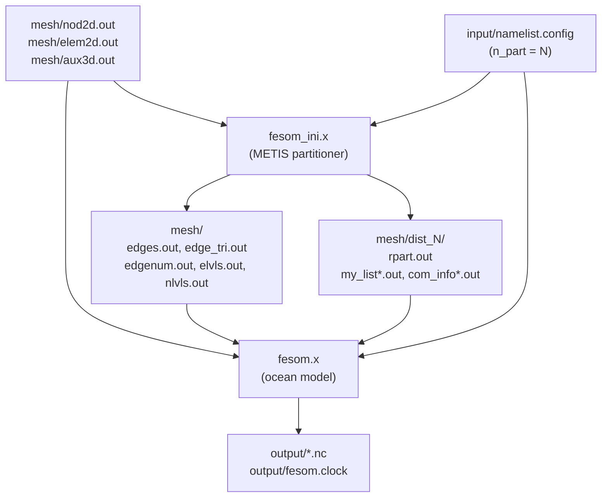

# FESOM2 experiment definitions

A self-contained, portable FESOM2 experiment is made of three independent
layers. Understanding their separation is essential for reproducibility: the
mesh, the physics, and the output are each independently versioned and can be
changed without touching the others.

---

## The three layers

### Layer 1 — Mesh (`mesh/`)

The mesh is the domain. It is defined by exactly three ASCII files:

| File | Content |
|---|---|
| `nod2d.out` | `[V; index lon lat tag]` — coordinates of V surface nodes; `tag` is an obsolete FESOM1.4 boundary flag (0 = interior, 1 = solid boundary), read but ignored by FESOM2 |
| `elem2d.out` | `[C; n1 n2 n3]` — triangular connectivity, 1-indexed, C triangles (a 4th column is accepted for mixed tri/quad meshes) |
| `aux3d.out` | `[L; h_1…h_L; H_1…H_V]` — L level interface depths, then bottom depth at each of V nodes (default); with `use_depthonelem=.true.` the H values are at elements instead |

These three files fully specify the domain geometry and bathymetry. Everything
else in the mesh directory is **derived** from them.

Some toy experiments also require additional files read by the Fortran
initial-state routine directly from `MeshPath`. For `neverworld2`:
`windstress.out` (a lat/τ profile, used when `do_wind=.true.` and
`wind_opt=1`) or `windstress@elem.out` (wind stress pre-interpolated to
elements, used when `wind_opt=2`).

The mesh is typically generated by a Python script (`create_mesh.py`) that
writes the three files. Committing the script alongside the generated files
documents how the mesh was made and makes it reproducible from scratch.

### Layer 2 — Namelists (`input/`)

Eight files control the physics, numerics, and I/O:

| File | Controls |
|---|---|
| `namelist.config` | run length, clock, paths, ALE scheme, geometry, component switches, `which_toy`, `n_part` |
| `namelist.oce` | ocean dynamics: bottom drag, GM/Redi, mixing scheme, EOS |
| `namelist.tra` | tracer physics: diffusivities, IC file references, surface restoring |
| `namelist.dyn` | momentum viscosity and solver options |
| `namelist.cvmix` | CVMix library coefficients (KPP, TKE, PP) |
| `namelist.ice` | sea-ice dynamics and thermodynamics |
| `namelist.io` | output variable list, frequencies, precision |
| `namelist.forcing` | bulk-formula coefficients and forcing file paths |

Three values in `namelist.config` are **container-internal** and are always
patched by the entrypoint at startup: `MeshPath`, `ResultPath`, and
`ClimateDataPath`. Every other parameter — including `run_length`,
`step_per_day`, `n_part`, `which_toy` — is set by the user in the files and
is never modified by infrastructure.

### Layer 3 — Output (`output/`)

NetCDF files written by `fesom.x`. Gitignored; reproduced by running the
experiment. A `fesom.clock` file is written here at startup (cold-start
format: two identical `time day year` lines) and updated at the end of each
run to enable warm restarts.

---

## The pipeline



The partitioner (`fesom_ini.x`) is a separate executable built from the same
FESOM2 source. It reads `n_part` from `namelist.config` and writes two sets
of outputs: derived geometry files (`edges.out`, `edge_tri.out`, `edgenum.out`,
`elvls.out`, `nlvls.out`) into the mesh root directory, and the METIS
partition files (`rpart.out`, `my_list*.out`, `com_info*.out`) into
`dist_N/`. This step only needs to run once per `(mesh, N)` pair where N is
the total MPI rank count. If `dist_N/` already exists, `fesom.x` uses it
directly.

---

## Docker interface

```
docker run --rm \
  -v $EXP/mesh:/mesh:ro \     # mesh files (nod2d, elem2d, aux3d, dist_N/, ...)
  -v $EXP/input:/input:ro \   # all eight namelist files
  -v $EXP/output:/output \    # model output
  fesom2:latest
```

The entrypoint:

1. Copies `/input/namelist.*` to a temporary work directory
2. Patches only `MeshPath → /mesh/`, `ResultPath → /output/`,
   `ClimateDataPath → /dev/null/` (toy runs need no climate data)
3. Writes `/output/fesom.clock` from `clockinit` values (cold start)
4. Reads `n_part` from the patched `namelist.config`
5. Runs `mpirun --allow-run-as-root -np N fesom.x`

All other parameters — `run_length`, `step_per_day`, `n_part`, `which_toy` —
are read directly from the committed `input/namelist.config`. The entrypoint
never overrides them.

---

## Experiment directory layout

Experiments are organised by model under `experiments/`:

```
experiments/
├── fesom2/
│   ├── toy_neverworld2/
│   └── pi_test/            (real NetCDF forcing)
└── mitgcm/
    └── rotating_convection/
```

Each FESOM2 experiment directory:

```
experiments/fesom2/<name>/
├── mesh/
│   ├── create_mesh.py    how the mesh was made (script, committed)
│   ├── nod2d.out         node coordinates              (committed for small meshes)
│   ├── elem2d.out        triangular connectivity        (committed for small meshes)
│   ├── aux3d.out         level depths + bathymetry      (committed for small meshes)
│   ├── windstress.out    toy-specific wind profile      (if needed by which_toy)
│   ├── edges.out         }
│   ├── edge_tri.out      } derived geometry — written to mesh root by fesom_ini.x
│   ├── edgenum.out       } (committed for small meshes, else regenerated)
│   ├── elvls.out         }
│   ├── nlvls.out         }
│   └── dist_2/           METIS partition for 2 ranks   (committed or regenerated)
├── input/
│   ├── namelist.config
│   ├── namelist.oce
│   ├── namelist.tra
│   ├── namelist.dyn
│   ├── namelist.cvmix
│   ├── namelist.ice
│   ├── namelist.io
│   └── namelist.forcing
├── output/               gitignored — created at runtime
├── README.md
├── run.sh                docker run command
└── plot.py               visualisation (committed alongside output figure)
```

For experiments with real NetCDF forcing, a fourth mount is added:

```
├── forcing/              NetCDF forcing files — committed if small (test data),
                          else mounted from external storage
```

Large meshes (`dist_N/`, `nod2d.out` > ~1 M nodes) should be gitignored and
regenerated via `create_mesh.py` + `fesom_ini.x`. The gitignore convention
for this project:

```gitignore
experiments/*/*/output/
experiments/*/*/mesh/dist_*/    # add when meshes grow beyond git-friendly size
```

---

## Notes

- `toy_ocean = .true.` bypasses the bulk forcing pipeline entirely — no
  atmospheric forcing files are needed. `namelist.forcing` must still exist
  (FESOM2 opens it unconditionally at startup) but its contents are ignored.
- The `which_toy` value in `namelist.config` selects the Fortran
  initial-state routine (`initial_state_neverworld2`,
  `initial_state_soufflet`, …). The mesh must match the toy configuration
  geometry or the initial state will be silently wrong.
- For toy runs with `state_equation = 0` (linear EOS), salinity is carried
  as a passive tracer. Only temperature drives buoyancy (α = 2×10⁻⁴ K⁻¹,
  ρ₀ = 1028 kg m⁻³ by default).
